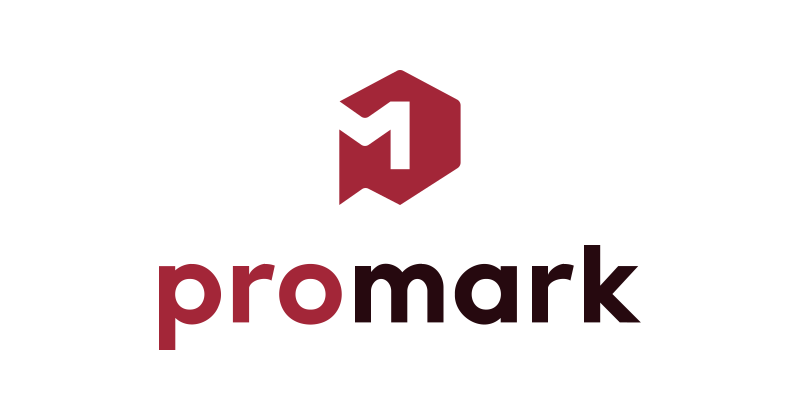

<!-- Banner -->

  
  <picture>
    
  </picture>  

 

<!-- Badges - 1st row -->

  <!-- Commit style badge -->
    
  <!-- License badge -->
      
  <!-- License badge -->
      

---

<h3 align="center">
  Main short lead line about project.
</h3>

  Various practical, handy, and opinionated <b>Adobe Illustrator templates</b> 
  for <b><i>logos, icons, banners,</i></b> and <b><i>general vector assets</i></b>.

---

<!--

**Here are some ideas to get you started:**

🙋‍♀️ A short introduction - what is your organization all about?
🌈 Contribution guidelines - how can the community get involved?
👩‍💻 Useful resources - where can the community find your docs? Is there anything else the community should know?
🍿 Fun facts - what does your team eat for breakfast?
🧙 Remember, you can do mighty things with the power of [Markdown](https://docs.github.com/github/writing-on-github/getting-started-with-writing-and-formatting-on-github/basic-writing-and-formatting-syntax)
-->
